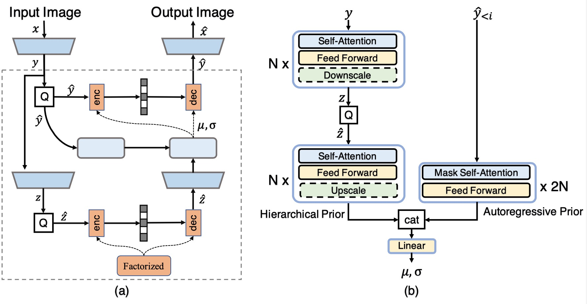
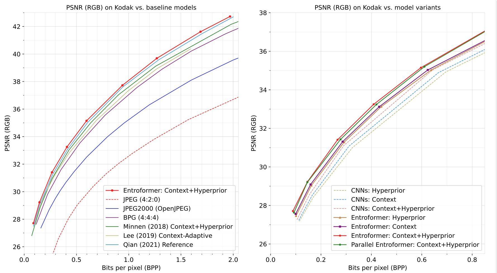

# [ICLR2022] Entroformer: A Transformer-based Entropy Model for Learned Image Compression [[pdf]](https://arxiv.org/abs/2202.05492)

The official repository for [Entroformer: A Transformer-based Entropy Model for Learned Image Compression](https://arxiv.org/abs/2202.05492).

## Pipeline



## Evaluation on [Kodak](http://r0k.us/graphics/kodak/) Dataset



## Requirements

### Prerequisites

Clone the repo and create a conda environment as follows:

```bash
conda create --name entroformer python=3.7
conda activate entroformer
conda install pytorch=1.7 torchvision cudatoolkit=10.1
pip install torchac
```

(We use PyTorch 1.7, CUDA 10.1. We use torchac for arithmetic coding.)

### Test Dataset

[Kodak](http://r0k.us/graphics/kodak/) Dataset

```
kodak
├── image1.jpg 
├── image2.jpg
└── ...
```

## Train & Evaluate & Comress & Decompress

**Train:**

```bash
sh scripts/pretrain.sh 0.3
sh scripts/train.sh [tradeoff_lambda(e.g. 0.02)]
(You may use your own dataset by modifying the train/test data path.)
```

**Evaluate:**

```bash
# Kodak
sh scripts/test.sh [/path/to/kodak] [model_path]
(sh test_parallel.sh [/path/to/kodak] [model_path])
```

**Compress:**

```bash
sh scripts/compress.sh [original.png] [model_path]
(sh compress_parallel.sh [original.png] [model_path])
```

**Decompress:**

```bash
sh scripts/decompress.sh [original.bin] [model_path]
(sh decompress_parallel.sh [original.bin] [model_path])
```

## Trained Models

Download the pre-trained [models](https://drive.google.com/drive/folders/1pBljoMLghpaGS0t5iywuUkMwCTV0GeSe?usp=sharing) optimized by MSE.

Note: We reorganize code and the performances are slightly different from the paper's.

## Acknowledgement

Codebase from [L3C-image-compression](https://github.com/fab-jul/L3C-PyTorch) , [torchac](https://github.com/fab-jul/torchac)

## Citation

If you find this code useful for your research, please cite our paper

```
@InProceedings{Yichen_2022_ICLR,
    author    = {Qian, Yichen and Lin, Ming and Sun, Xiuyu and Tan, Zhiyu and Jin, Rong},
    title     = {Entroformer: A Transformer-based Entropy Model for Learned Image Compression},
    booktitle = {International Conference on Learning Representations},
    month     = {May},
    year      = {2022},
}
```
